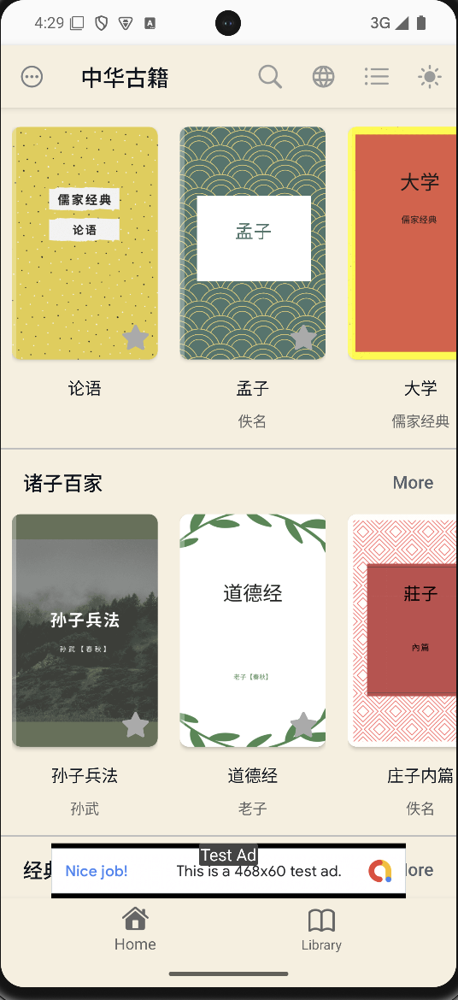
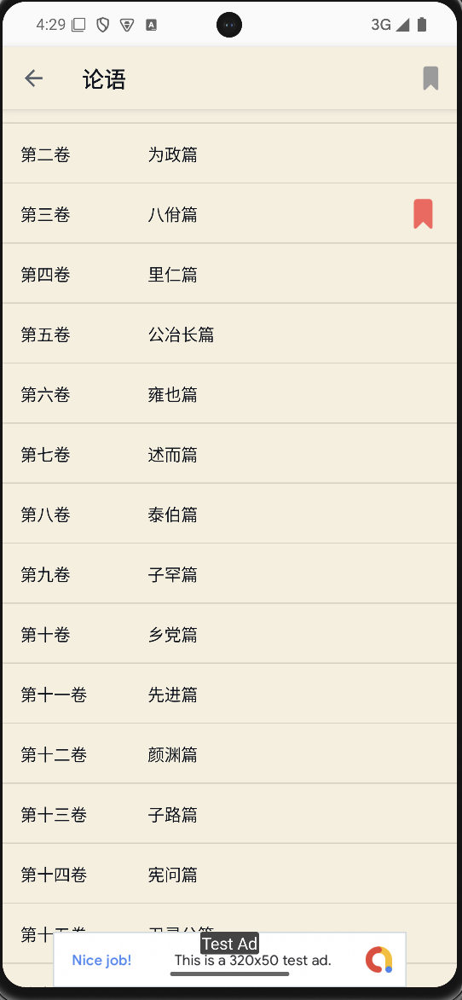
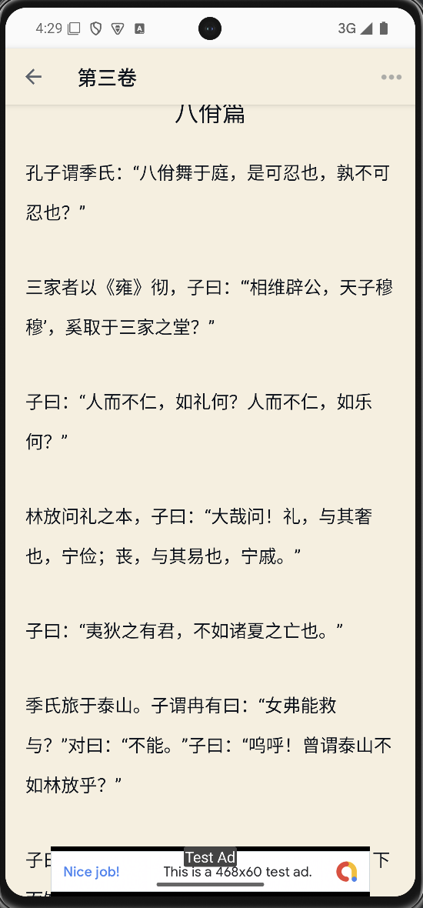

# Chinese Classical Literature (中华古籍) - Android Reader App

[](https://play.google.com/store/apps/details?id=com.appsbay.chineseclassicalliteratural)

阅读经典，体验中华经典古籍和文化！

This Android app provides a free reading experience of a vast collection of classical Chinese literature. Begin your journey through the depth of Chinese history, philosophy, and culture.


---

## Screenshots

<p align="center">
  
  
  
</p>

---

## Features

- **Bookmarking**: Save your reading progress at any time, allowing you to resume where you left off.
- **Font Size Adjustment**: Adjust the font size to match your reading preference.
- **Custom Reading Background**: Enjoy beautiful wallpaper backgrounds to enhance your reading experience, and switch backgrounds according to your personal taste.
- **AdMob Integration**: This app uses Google AdMob for ads.

---

## Installation

### 1. Clone the Repository

```bash
git clone https://github.com/banghuazhao/Chinese-Classical-Literature-Android.git
```

### 2. Open the Project
Open the project in Android Studio.

### 3. Set Up Google AdMob
This app uses AdMob integration, and you need to set up the google-services.json file for the app to run correctly with ads.

1. Go to the Google Firebase Console.
2. Create a new project or use an existing one.
3. Navigate to Project Settings and add an Android app to your project.
4. Download the google-services.json file after configuration.
5. Place the google-services.json file in the following directory:

```bash
app/src/google-services.json
```

### 4. Build and Run the App
Build and run the app on an Android emulator or physical device.

---

## Available Books

A rich collection of Chinese classics, including but not limited to:

大唐西域记, 隋唐演义, 鹤冠子, 关尹子, 吕氏春秋, 醒世恒言, 二刻拍案惊奇, 公孙龙子, 墨子, 文子, 尉缭子, 列子, 千家诗, 浮生六记, 隋炀帝艳史, 颜氏家训, 荀子, 淮南子, 梦溪笔谈, 初刻拍案惊奇, 文心雕龙, 管子, 周易, 豆棚闲话, 山海经, 菜根谭, 镜花缘, 道德经, 中庸, 大学, 尚书, 论语, 古文观止, 喻世明言, 孙子兵法, 东周列国志, 孝经, 桃花扇, 洛神赋, 金石缘, 封神演义, 儒林外史, 孟子, 庄子, 冰鉴, 韩非子, 商君书, 礼记, 左传, 老残游记

---

## Contributions

Contributions are welcome! Feel free to open issues or submit pull requests if you encounter bugs or have suggestions for new features.

