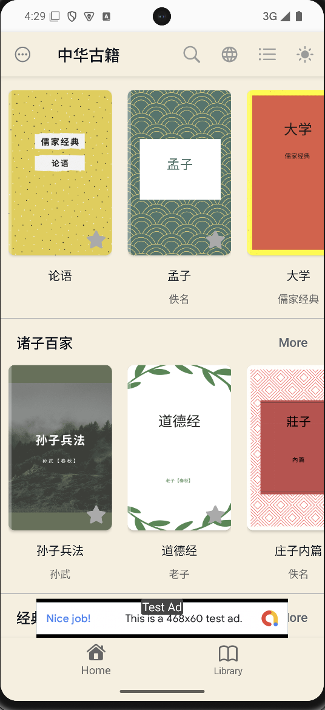
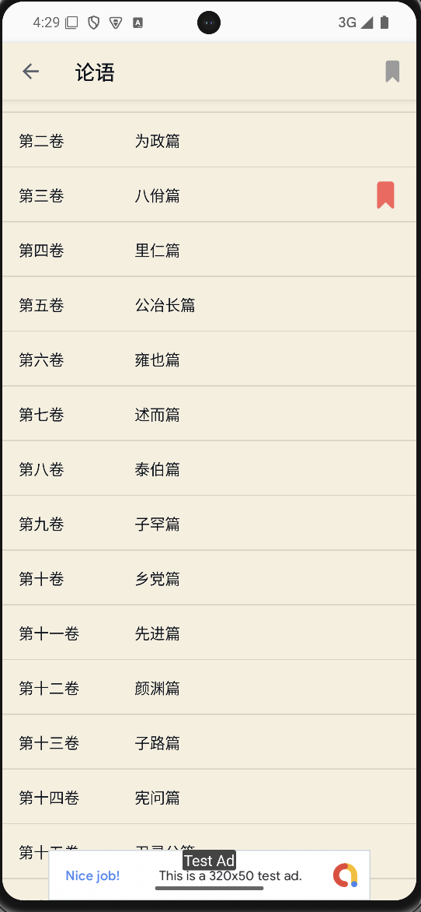
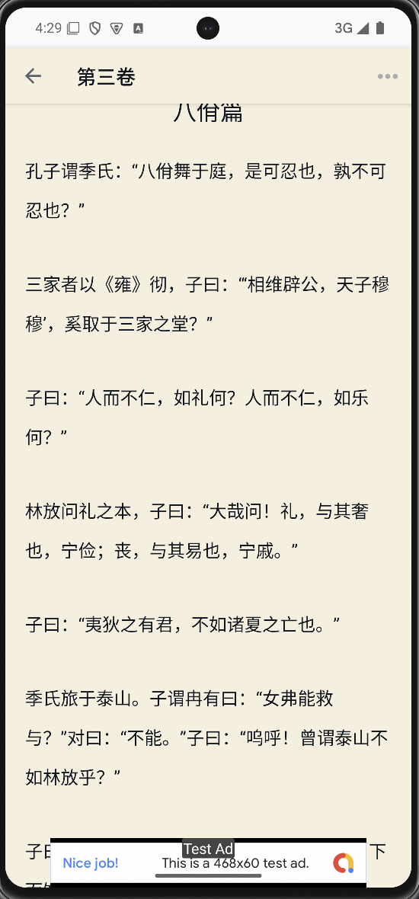

# Chinese Classical Literature (中华古籍) - Android Reader App

[](https://play.google.com/store/apps/details?id=com.appsbay.chineseclassicalliteratural)

阅读经典，体验中华经典古籍和文化！

This Android app provides a free reading experience of a vast collection of classical Chinese literature. Begin your journey through the depth of Chinese history, philosophy, and culture.


---

## Screenshots

<p align="center">
  
  
  
</p>

---

## Features

- **Bookmarking**: Save your reading progress at any time, allowing you to resume where you left off.
- **Bookshelves and Search**: Browse by category, search titles and authors, and organize favorites.
- **Simplified and Traditional Text**: Select the book script independently of the app interface language.
- **Interface Language**: Choose an app language from the More screen.
- **Offline Reading**: All included books are bundled with the app.
- **Font Size Adjustment**: Adjust the font size to match your reading preference.
- **Custom Reading Background**: Enjoy beautiful wallpaper backgrounds to enhance your reading experience, and switch backgrounds according to your personal taste.
- **AdMob Integration**: This app uses Google AdMob for ads.

---

## Installation

### 1. Clone the Repository

```bash
git clone https://github.com/banghuazhao/Chinese-Classical-Literature-Android.git
```

### 2. Open the Project
Open the project in Android Studio with JDK 17 or newer. The project uses Gradle 9.7 and Android SDK 37.

### 3. Set Up Google AdMob
This app uses AdMob integration, and you need to set up the google-services.json file for the app to run correctly with ads.

1. Go to the Google Firebase Console.
2. Create a new project or use an existing one.
3. Navigate to Project Settings and add an Android app to your project.
4. Download the google-services.json file after configuration.
5. Place the google-services.json file in the following directory:

```bash
app/google-services.json
```

### 4. Build and Run the App
Build and run the app on an Android emulator or physical device.

---

## Available Books

The app bundles 59 works in both simplified and traditional Chinese. Highlights include:

- Classics: 论语, 孟子, 大学, 中庸, 诗经, 尚书, 礼记, 周易, 左传.
- Philosophy: 道德经, 庄子, 孙子兵法, 墨子, 韩非子, 荀子, 吕氏春秋.
- Novels: 三国演义, 水浒传, 西游记, 红楼梦, 儒林外史, 封神演义, 镜花缘.
- Poetry and prose: 楚辞, 唐诗三百首, 千家诗, 古文观止, 山海经, 文心雕龙, 梦溪笔谈.

The added poetry texts are adapted from [chinese-poetry](https://github.com/chinese-poetry/chinese-poetry) under the MIT license. The full notice is in [THIRD_PARTY_NOTICES.txt](app/src/main/assets/THIRD_PARTY_NOTICES.txt).

---

## Contributions

Contributions are welcome! Feel free to open issues or submit pull requests if you encounter bugs or have suggestions for new features.
